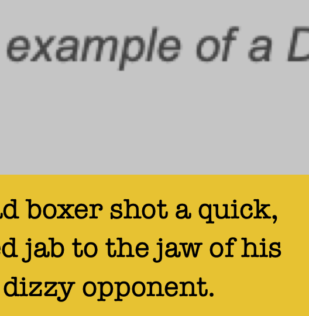

# JTextBoX

A JSUI text-rendering project for Cycling 74's Max platform by Neil Baldwin, November 2023.

For updates and changes see the end of this document.

**Important update 16/11/2023** : an extra parameter has been added to the instance parameters - see "Instance Parameters" and "Over-Scaling Factor" below. If you forget to add it there's a check to prevent rendering failure but have a read, it's a good one!


## What is JTextBox

JTextBox is a JSUI object that enables you to easily draw formatted text inside a "text box" in your Max application. Through HTML-like tags and CSS-like style definitions JTextBox allows you to define and use inline styling in your text: font selection, font size, line height and header definitions.

## Rationale

The idea came from another JSUI project I was working on where I needed to create a text-based information display using different font weights to separate parameter headings from parameter values. Doing this manually in JSUI is quite tedious due to the fact that you need to use font metrics to properly calculate screen positions and so mixing fonts and font sizes, even in a simple application, becomes a back and forth between settings fonts, measuring that portion of text, positioning that text then rendering it to the screen.

"There has to be a better way!" I thought, as seems to be the case for several other of these little JSUI helper projects I've done on my JSUI journey.

Hence: JTextBox

## Contents and Installation

Place the files in your Max search path.

`JTextBox_class.js`
This is the main file that contains the object class for the JTextBox object.

`JTextBox.maxpat` & `JTextBox.js`
Demo patcher and JSUI file to illustrate how to set up and use JTextBox.

`readme.md`
This file.

## How To Use JTextBox

There are two conditions that need to be fulfilled in order to use JTextBox: **style definitions and coded text strings**.

### Style Definitions

You need to create a dictionary in your JSUI file that describes the text you want to render. There are two aspects to this: **Base Style** and **Tag Styles**. *Base Style* defines the default properties for the whole text string where *Tag Styles* allows you to add *tags* (a little like HTML tags) to add custom formatting to specific portions or words of the text string. An example or two will likely make this clearer.

#### Base Style Without Tag Styles

```javascript
var myStyles = {
  "basic" : {
    "font" : "Ableton Sans Medium",
    "size" : 16,
  }
}
```
This defines a simple style called `"basic"` that uses the "Ableton Sans Medium" font at size 16.

Then we can add a second style and define a few more specific attributes:

```javascript
var myStyles = {
  "basic" : {
    "font" : "Ableton Sans Medium",
    "size" : 16,
  },
  "complex" : {
    "font" : "Ableton  Sans Light",
    "size" : 16,
    "lineheight" : 1.4,
    "color" : [1.0, 0.0, 0.0, 1.0],
    "background" : [0.0, 1.0, 0.0, 1.0],
    "padding" : 16
  }
}
```
So we now have two styles in our style dictionary, the `basic` one and the new `complex` one. You can add as many as you like. The `complex` style here uses all of the available styling keys (apart from `align` - see below): JTextBox isn't meant to be fully HTML.

#### JTextBox Style Keys

| Key | Styling | Notes |
|---|---| --- |
|`font`| (string) selects the font name | Any available font on your system *1 |
|`size`| (points/pixels) sets the font size | |
|`lineheight`| (float) sets the text line height (vertical spacing between text lines) | Default is 1.0 |
|`color`| (RGBA) sets the color of the text in RGBA format | |
|`background`| (RGBA) sets the background color of the text box in RGBA format | |
|`padding`| (pixels) sets internal padding for the text box in pixels | |
|`align`| `"left"`, `"right`" or `"center"` - see note below| Default is `"left"`|

*1 Be aware that a selcted font may not be available on other computers/systems if you intend to distribute your Max application. If it's just for you, go for it!

#### How do I find out what fonts I can use?

In a Max patcher, add the following:

```
[bang]-->[fontlist]-->[umenu]
```

Sending a `bang` to the `fontlist` object will populate the `umenu` with all the available fonts on your system. From here you just need the quoted "name" of the font to add to your style dictionary.

#### Extending the Base Style with Style Tags

Here's where it gets interesting and a little more complicated! Let's go back to the `"basic"` style we defined earlier:

```javascript
var myStyles = {
  "basic" : {
    "font" : "Ableton Sans Medium",
    "size" : 16,
  }
}
```
Now say you wanted to define an inline style to make a word **bold**. You can do that with **Style Tags**.

```javascript
var myStyles = {
  "basic" : {
    "font" : "Ableton Sans Medium",
    "size" : 16,
    "bd" : { },
    "st" : {
      "font" : "Ableton Sans Bold"
    }
  }
}
```
Two things have changed here, the addition of the two keys `"bd"` and `"st"`. I'll explain but first an important facet of JTextBox in comparisson to, say, HTML/CSS.

>#### JTextBox and Inline Styling
>
>While JTextBox uses styling keywords (and a simplified version of HTML-style tags with which to employ that styling - we'll get to that), you need to be aware that **the tag system is not nested or cascading**. In your encoded text (text string with formatting tags) you use a formatting tag to tell JTextBox "start rendering the rest of the text like this" - *there are no closing tags to define the end of the sub-formatting*. If you want to end the current sub-formatting you have to switch to a different sub-format with another tag.

So in the last example, until now we haven't needed to tell JTextBox what it should consider *normal text*. If you're going to use inline styling you need to have a "normal" key so that you can insert it after sub-formatted text so the renderer returns to "normal". That's what the `"bd"` key is doing here - "normal" is whatever you've defined in the Base Style.

Secondly the `"st"` key is used to tell the renderer *"wherever you find an `<st>` key in the coded text, start rendering the rest of the text with this format"* - here we're simply changing the font to a bold font but you can change any of the formatting (as scoped in the table above).

#### BD and ST: why are tags formatted that way?

JTextBox text coding strictly requires tags of two letters e.g. `<bd>` and `<st>`. While it's necessary that a tag is made up of a two letter string, the two letters themselves can be anything. In my examples I've just used "bd" and "st" to sort of mean "body" and "strong" (bold) (like `<body>`  and `<strong>` in HTML). These two letter tag codes obviously need to match keys in the style tags in your styling dictionary.

#### Special Cases

While I said you're free to make your own two-letter tags there are two special cases that need to be observed in order that the renderer works as expected. These are the tags to denote a **heading** and a **carriage return** (new line).

| Function | Key/Tag | Notes |
|---|---|---|
| Carriage Return | `<cr>` | Inserts a new line/carriage return in the text output. Requires no equivalent style key in the style dictionary |
| Headings | `"h-"` `<h->` | A tag that starts with the letter 'h' will tell the renderer to add a new line at the following tag (hence defining whatever is between the `<h->` tag and the next tag in the text as a heading). The `"-"` part of the tag can be any character e.g h1, h2, h3 |

#### Left, Right and Center Alignment

This is a new feature as of 15/11/2023.

It's now possible to specify text alignment via the `align` key in your style dictionary. This works for both the base style and the tag styles though if you try to use it as an inline style in a paragraph or sentence the results will likely be odd and, even more likely, unpredictable. Have a go though. If you think you've broken something let me know - there are far too many possible edge cases for me to test on my own volition!

### Coded Text Strings

Until now we've only covered how to set up your styling. The other half to using JTextBox is **Coded Text Strings**

A coded text string is basically a regular text string with tags inserted where you want to instruct the renderer to format the text in a specific way. As I've already mentioned, unlike HTML **JTextBox text does no use closing tags**. For example, a string withouth formatting tags could be:

```javascript
var myText = "The quick brown fox jumps over the lazy dog."
```

If you wanted to make "brown fox" bold text you would first need to add the bold tag to your style dictionary (and the 'normal' text tag, see above) and then add the tags to your string. So first set up your style dictionary:

```javascript
var myStyles = {
  "basic" : {
    "font" : "Ableton Sans Medium",
    "size" : 16,
    "bd" : { },
    "st" : {
      "font" : "Ableton Sans Bold"
    }
  }
}
```
Then add the tags to your text string:

```javascript
var myText = "<bd>The quick <st>brown fox <bd>jumps over the lazy dog."
```

which will then render:

>The quick **brown fox** jumps over the lazy dog.

As you can see, if you want to switch to bold and then back again, we start the string off with the tag for 'normal' text, `<bd>` then add the `<st>` tag to tell the rendered to look up the styling for that key and apply it to the remainder of the text. But, as we only wanted the "brown fox" in bold, we added the 'normal' tag again to end the bold style.

#### Headings

As explained above, tags starting the the letter 'h' are reserved for rendering headings. If you want to format part of your text string as a heading, first define the style and then add the tag as before:

```javascript
var myStyles = {
  "basic" : {
    "font" : "Ableton Sans Medium",
    "size" : 16,
    "bd" : { },
    "st" : {
      "font" : "Ableton Sans Bold"
    },
    "h1" : {
      "font" : "Impact",
      "size" : 24,
      "lineheight", 1.4,
      "color" : [1.0, 0.0, 0.0, 1.0]
    }
  }
}
```
Then format your text string:

```javascript
var myText = "<h1>THIS IS A BIG RED HEADING<bd>And this is regular text."
```

which will render something like:

>**THIS IS A BIG RED HEADING**
>And this is regular text.

but obviously the heading will be using the "Impact" font and be colored red. And bigger.

### Using JTextBox

We've covered how to create base styles in your style dictionary and how to extend those styles with style tags so the last step is how to instantiate a JTextBox text box in your project.

#### Adding the JTextBox Class

Simply use an include command somewhere at the top of your JSUI file:

```javascript
include("JTextBox_class.js)
```

#### Creating a new JTextBox Object

```javascript
var myCoolTextBox = new JTextBox(this, myText, myStyles["basic"], 10, 20, 300, 200, 1.0)
```

This will create a new text box at X:Y position 0:0 which is 300 pixels wide and 200 pixels high and an "over-scale" factor of 1.0 (see below) - the text box will contain the text in the string `myText` and will have it's style determined by the style `"basic"` in the style dictionary `myStyles` - note how to reference a style inside the styles dictionary: `styles["style name"]`

Note: the first parameter must be **`this`** - it's used to pass a reference to the JTextBox's parent object (the JSUI window). If that doesn't make any sense to you don't worry about it. Just make sure to included it as the first parameter.

#### Instance Parameters

```javascript
var TEXT_BOX_NAME = new JTextBox(this, TEXT, STYLES["STYLE NAME"], X, Y, WIDTH, HEIGHT, OVER-SCALING-FACTOR)
```

`TEXT` is the formatted text string that you want to render inside the text box

`STYLES` is the name of the dictionary that holds all of your text styles

`STYLE NAME` is the name of the style in your style dictionary with which to render the text

`X` is the X position in pixels of the text box inside the JSUI window**

`Y` is the Y position of the text box inside the JSUI window**

`WIDTH` is the width in pixels of the text box**

`HEIGHT` is the height in pixels of the text box**

`OVER-SCALING-FACTOR` sets the image rendering scale (see below)

** Remember if you specify X/Y/WIDTH/HEIGHT of `0, 0, 0, 0` the text box will be a dynamic (resizable) one that takes up the entire JSUI window

#### Over-Scaling Factor

A new feature as of 16/11/2023.

Internally, each section of the text is actually rendered into an image and then that image is placed on the JSUI canvas. This was necessary in order to implement the alignment settings. A consequence of this is that when zoomed in on the Max window, the text will become pixelated.

"Over-Scaling" allows you to set a factor by which the size of the text image is multiplied, which is then scaled back down when the text image is rendered to the canvas. This means you can, if required, over-scale the text so that when you zoom into the Max window the pixelation is reduced.

Default is 1.0. Settings of 2.0 or 4.0 are sensible. You can probably break it if you overdo it.

This shows the difference between 1.0 and 4.0 when zoomed in. The top text is rendered with an over-scale factor of 1.0, the bottom has a scale of 4.0:




### Putting It On The Screen

The final final step! Believe me it's easier than doing this manually. In your JSUI paint function, call your JTextBox's paint function:

```javascript
function paint() {
  myCoolTextBox.paint();
}
```

#### Dynamic and Static JTextBox

There are in fact two types of text box you can create: **static** and **dynamic**

| Text Box Type | Properties |
|---|---|
| Static | Places a fixed size text box inside your JSUI window at the specified coordinates. Resizing the JSUI window has no effect on the text box's size or position. You can create and place multiple static JTextBox objects inside a single JSUI object. They can overlap and the Z-order in which they are drawn is determined by the order of the JTextBox.paint() functions in your JSUI paint function.|
| Dynamic | Turns your entire JSUI into a text box. Resizing the JSUI window will resize and reposition text determined by the automatic word-wrapping. You can only instantiate one dynamic text box in your JSUI. If you want multiple dynamic text boxes you need to add another JSUI object to your Max patcher.

#### How to instantiate a Static or Dynamic JTextBox

To instantiate a **Static JTextBox** you just need to specify a width and height bigger than 0 (zero) e.g.

```javascript
var myCoolTextBox = new JTextBox(this, myText, myStyles["basic"], 10, 20, 300, 200, 1.0)
```

> **Multiple JTextBox-es**
> Note: if you want to add more than one static JTextBox to your JSUI you'll need to call the `.paint()` method for each one in your JSUI paint() function/

To instantiate a **Dynamic JTextBox** just set the width and height parameters to 0 e.g.

```javascript
var myCoolTextBox = new JTextBox(this, myText, myStyles["basic"], 0, 0, 0, 0, 1.0)
```

> **Dynamic Resizing**
>To take advantage of the resizing feature of Dynamic JTextBox you need an additional function call in the `onresize()` function in your JSUI:

```javascript
function onresize(width, height) {
  // JSUI system method to resize JSUI window
  this.box.size(width, height)
  // Call your JTextBox resize function
  myCoolTextBox.calcWindow()
}
```

#### Default Styling

It is possible to use JTextBox to create simple "unstyled" text.

```javascript
var plainText = "This is some very plain text."

var myPlainTextBox = new JTextBox(this, plainText, {}, 0, 0, 100, 100, 1.0)
```
Instead of specifying a style dictionary, use a pair of empty curly braces, `{}`. This will render the text with the default parameters (and in this case place it at 0:0 with a width/height of 100/100): 

* font = "Ableton Sans Medium"
* font size = 12
* line height = 1.0
* background color = transparent [0.0, 0.0, 0.0, 0.0]
* text color = black [0.0, 0.0, 0.0, 1.0]
* padding = 8 pixels
* align = left

#### Word Wrapping

Regardless of the instance type (static or dynamic) or styling, JTextBox will always automatically word-wrap your text to its containing rectangle. This only works horizontally, pushing words onto the next line if they won't fit inside the width of the rectangle - if any of the text exceeds the vertical dimension of the text box, that part will be clipped and not rendered.

## Technical Bit

If you're uninterested in how I approached it, turn off now.

The rendering is split into two stages: tag mapping and rendering.

#### Tag Mapping

Your coded text string is scanned for tags and the position (index into the text string) and type of each one is added to an array before rendering.

#### Rendering

Then the tag array is scanned and for each tag the renderer looks to see if there's a corresponding key in the specified style dictionary, then any changes are applied to the render output (font, font size) etc. The for that tag, the text extracted and is split into individual "words" (split using " " as a delimiter). This part is necessary for the word-wrapping as the render width is calculated by adding the pixel width of each word until it exceeds the width of the text box, thus forcing the render position to start on a new line.

#### Rendering as of 15/11/2023

Major refactoring of the rendering engine to accomodate right-aligned text!

The rendering now uses a second MGraphics canvas to render rows of text to. When the line is 'full' the text canvas is rendered to an image and then that image is drawn to the main MGraphics instance. The reason for this is so that it can offset the X-position from the left or the right when rendering each single row of text to the screen.

As a consequence I realised it would then be easy to add "center" as an alignment option, so you can do that too now.

## Updates and Changes

#### 16/11/2023

* Added a new instance variable `over-scaling-factor` - this is used to force the rendering engine to render the text images at higher resolutions (and then are scaled back to the correct font size before rendering the text box) which makes a huge improvement to pixelation when zoomed into the Max window. See details above in **"Over-Scaling Factor"**

#### 15/11/2023

* Change: Refactored the whole rendering engine (see **Technical Bit** above) in order to incorporate left and right alignment.

* Addition: to make use of the new left/right aligment rendering there's a new style parameter "align" which can be set to "left", "right" or "center" - "left" is default.

* Bug fix: had the wrong name for the default font as "Ableton Sans Regular" - now corrected to "Ableton Sans Medium"
